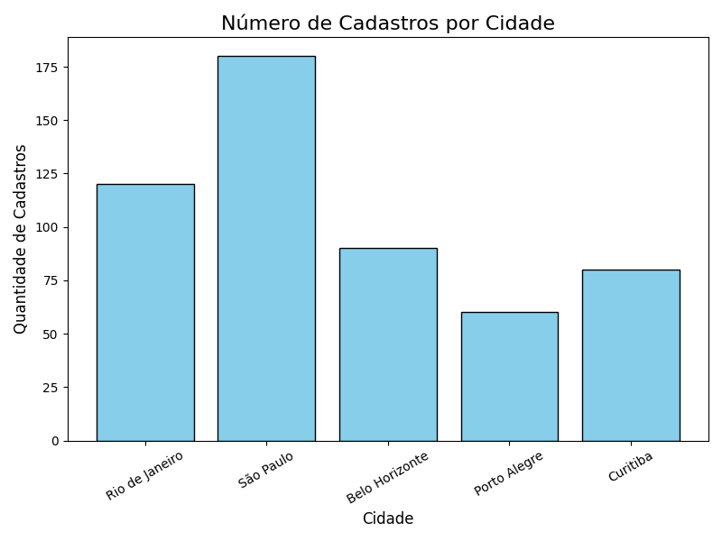

# Projeto: Limpeza de Planilha Excel com Python

Este projeto realiza a limpeza e normalização de dados de uma planilha Excel utilizando a biblioteca Pandas.
Além disso, gera um gráfico simples mostrando a quantidade de cadastros por cidade.

## Funcionalidades
- Normalização de nomes de colunas
- Remoção de linhas vazias
- Correção de idades
- Padronização de datas
- Preenchimento de valores nulos
- **Geração de gráfico** (cadastros por cidade)
- Salvamento da planilha tratada

## Como usar
1. Clone o repositório
2. Instale as dependências:
   ```
   pip install -r requisitos.txt
   ```
3. Coloque seu arquivo `dados_brutos.xlsx` na pasta `dados/`.
4. Execute o script:
   ```
   python limpeza_excel.py
   ```
5. Arquivos gerados:
   - `dados_tratados.xlsx` (planilha limpa)
   - `grafico_exemplo_readme.png` (gráfico de barras)

## Estrutura do projeto
```
📁 projeto-limpeza-excel
├── limpeza_excel.py
├── requisitos.txt
├── README.md
└── dados
    ├── dados_brutos.xlsx
    ├── dados_tratados.xlsx
    └── grafico_exemplo_readme.png
```

## Exemplo de Gráfico Gerado

